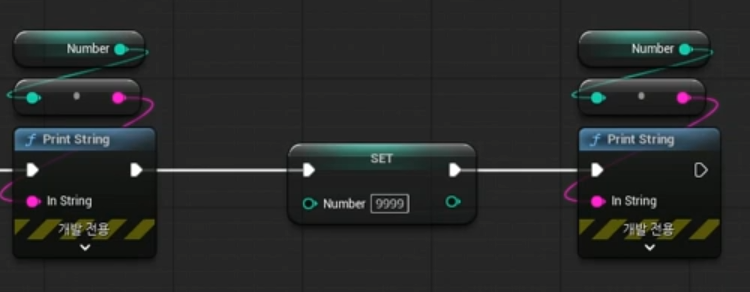
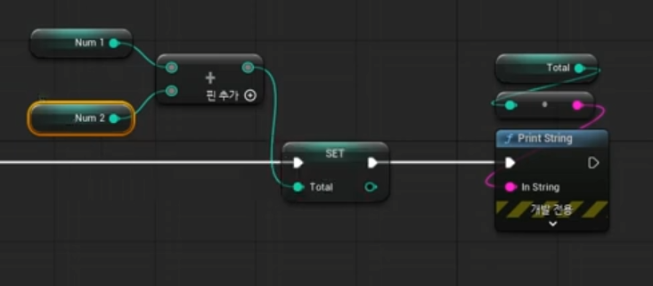

# [Unreal] 변수와 데이터 타입, 4칙 연산 기초

> TIL — 2026-08-6

변수랑 데이터 타입 정리하는 날. 프로그래밍 진짜 기초라 언리얼뿐 아니라 다른 언어 배울 때도 그대로 적용되는 개념.

## 변수 vs 상수

- 변수(Variable): 값이 계속 바뀔 수 있는 것. 메모리 공간을 할당받아서 값을 저장/갱신함
- 상수: 한 번 정해지면 안 바뀌는 고정값

변수는 결국 메모리에 자리 하나 잡고 앉아있는 거고, 그 자리에 뭘 얼마만큼 담을지 정해주는 게 데이터 타입.

## 데이터 타입

- `Boolean` — true/false
- `Integer` — 정수, 32비트짜리는 4바이트(Int32) 이런 식으로 크기 다름
- `Float` — 소수점 있는 수
- `String` — 문자열
- `Vector` — 좌표값 묶음
- `Transform` — 위치+회전+스케일을 한 번에 묶어놓은 거

타입에 따라 메모리 크기가 달라지니까, 필요한 만큼만 쓰는 게 중요하다고 함(안 그러면 메모리 낭비).

## 변수 이름

이름 겹치거나 애매하게 지으면 나중에 헷갈리고 디버깅할 때 골치아픔 → 명확하게 지어야 함. 당연한 얘기 같은데 막상 하다 보면 대충 짓게 되는 부분이라 신경 써야 할 듯.

## Get / Set

- Get: 변수 값을 읽어오기
- Set: 변수에 값을 써넣기

이 둘이 사실상 변수 다루는 거의 전부. 

## 4칙 연산

`+`, `-`, `×`, `÷` 그대로 있고 나머지 연산자 `%`도 있음. 변수 두 개 만들어서 각각 값 넣고, 둘을 연산해서 결과를 새 변수(Total 같은)에 저장한 다음 Print로 출력해보는 실습.

- 초기값 미리 세팅해두면 오류 줄어듦
- 값 바뀔 때마다 Print로 찍어보면 의도한 대로 동작하는지 바로 확인 가능

## 실습 데이터 삽입

처음 number는 초기 설정한 값이 나오고 set에서 값을 대입하고 print를 찍으면 9999나옴

## 실습 4칙 연산

노드에서 드래그 한 후 각 +,-,*,/ 를 찾아서 사칙연산을 해봤음

## 블루프린트에서 좋은 점

변수 만들고 연결하면 데이터 타입을 자동으로 맞춰줌.

---
