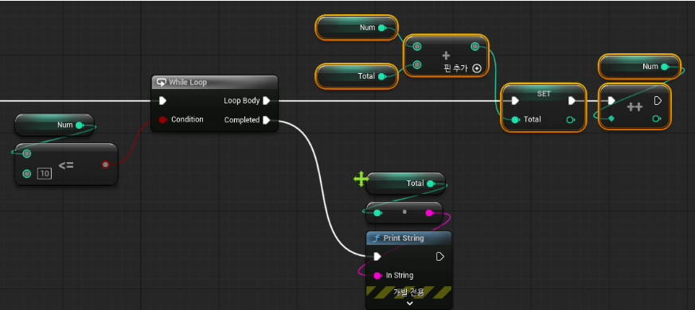
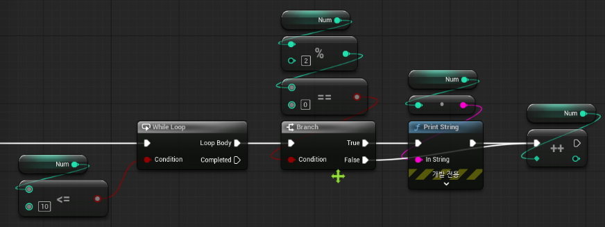

# [Unreal] 반복문 기초 

> TIL — 2026-08-10

반복문 종류는 크게 3개: `for`, `foreach`, `while`. 오늘은 `for`, `while` 위주로 정리.

## 반복문 왜 쓰는지

똑같은 동작을 100번, 1000번 반복해야 할 때 코드를 그만큼 복사해서 쓸 수는 없으니까 반복문으로 처리하는 거임. 반복 횟수가 눈 깜빡할 새보다 빠르게 처리된다는 게 신기했음 

## for 루프

시작 인덱스 종료 인덱스를 정해서 반복 횟수를 명확하게 제어함. 구조가 딱 정해져 있어서 "몇 번 반복할지" 확실할 때 쓰기 좋음.

핵심은 인덱스 값 자체를 그냥 반복 카운터로만 쓰는 게 아니라, 그 값으로 데이터에 접근하거나 출력에 활용할 수 있다는 것. 나중에 배열 다룰 때도 이 인덱스 개념이 그대로 이어진다고 함.

## while 루프

조건이 참인 동안 계속 돎. for처럼 반복 횟수를 미리 못 박아두는 게 아니라 "조건이 만족하는 동안" 계속 도는 방식이라 좀 더 자연스러움.

근데 여기서 진짜 조심해야 하는 게 조건을 바꿔줄 변수 증감 num++ 같은 거 안 넣으면 조건이 영원히 참이라 무한 루프에 빠짐. while 쓸 때는 "이 반복이 언제 끝나는지"부터 먼저 생각하고 시작하는 습관을 들여야 할 듯.

## 조건문이랑 결합하기

반복문 안에 `if` 조건문 넣으면 특정 조건에 맞는 것만 골라서 처리 가능. 예를 들면:

- 짝수만 출력하기 → 반복하면서 % 2 == 0인 값만 골라내기
- 홀수만 출력하기 → 반대 조건으로 하기

이 패턴은 진짜 어디서든 계속 쓰이는 조합이라 익숙해지는 게 중요해 보임.

## 실습

- 0 ~ 10 총합을 구하라 whileloop로 구현

- 0 ~ 10의 수중에 짝수만 출력 whileloop로 구현

---

느낀 점: 결국 반복문 이해는 인덱스 관리랑 "언제 멈추는가"를 정확히 아는 게 다인 것 같음. for는 횟수가 정해졌을 때, while은 조건 기반으로 유동적일 때 상황 따라 골라 쓰면 될 듯. 손에 익힐때까지 반복해야 할듯

## 참고
- [언리얼 반복문 기초](https://www.youtube.com/watch?v=wnEUyYfc4_4) — 강의 참고
