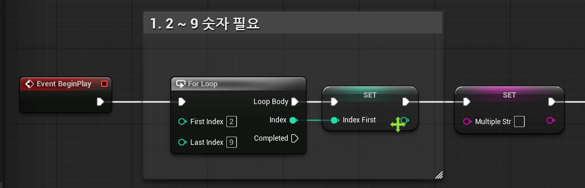
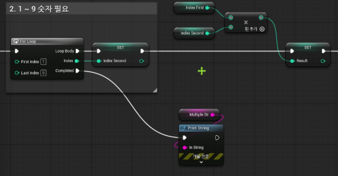
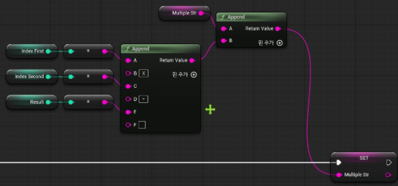
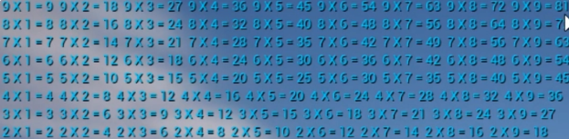
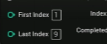
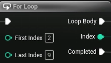
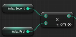
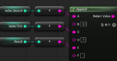

# [Unreal] 중첩 반복문  

> TIL — 2026-08-17

## 개념
반복문 안에 또 다른 반복문이 들어있는 구조. 블루프린트에서는 **For Loop** 노드 안에 또 다른 **For Loop** 노드를 연결해서 만든다.

- 바깥쪽 For Loop의 Loop Body 실행 핀에 안쪽 For Loop 노드를 연결
- 바깥 루프가 한 번 돌 때마다 안쪽 루프가 처음부터 끝까지 전부 실행됨
- 전체 반복 횟수 = 바깥 루프 횟수 × 안쪽 루프 횟수 

## 노드 구성

```
Event BeginPlay
   └─▶ For Loop  ← 바깥 루프 (단 담당)
          │ Index 바깥쪽 인덱스
          └─▶ Loop Body
                 └─▶ For Loop  ← 안쪽 루프 (곱하는 수 담당)
                        │ Index 안쪽 인덱스
                        └─▶ Loop Body
                               └─▶ Print String
```

- 바깥 For Loop의 **인덱스** 와 안쪽 For Loop의 **인덱스** 를 각각 Format Text 노드에 연결해서 Print String으로 출력하면 몇 단, 몇 번째 곱셈인지 화면에서 바로 확인 가능
- 헷갈릴 땐 곱셈 결과 없이 그냥 `i, j` 값만 Print String으로 찍어보면서 순서를 눈으로 먼저 확인하는 게 좋을 것 같음

## 실습 구구단 출력




결과 : 중첩 for문, append을 이용해서  


## 실습2 구구단 출력2(세로)
단과 곱하는 수 인덱스값을 서로 바꾸고 get 함수를 서로 뒤집어 

즉 index first 와 index second를 뒤집은 후 밑쪽 append에도 서로 위치를 바꾸면
세로 구구단 출력 완료





## 참고
- [중첩 반복문](https://www.youtube.com/watch?v=v5tRVmZN5KI) - 강의 참고